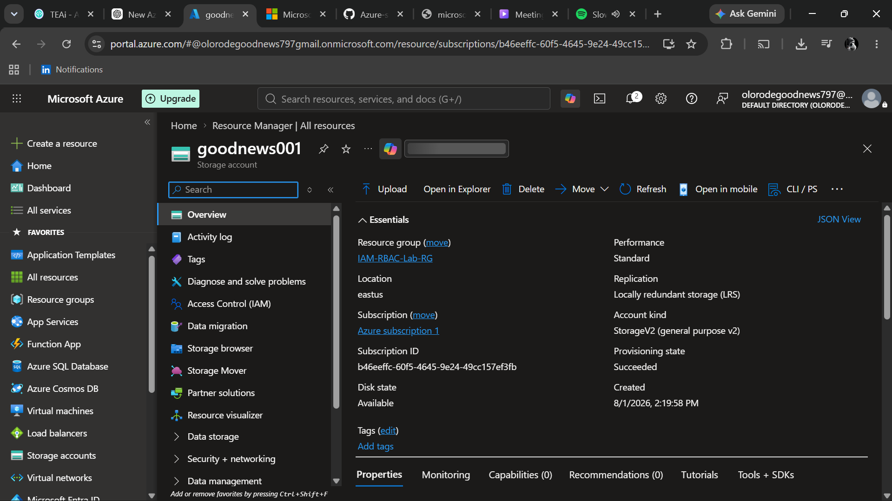
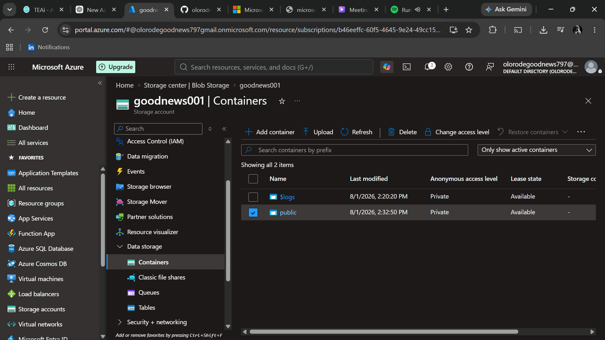
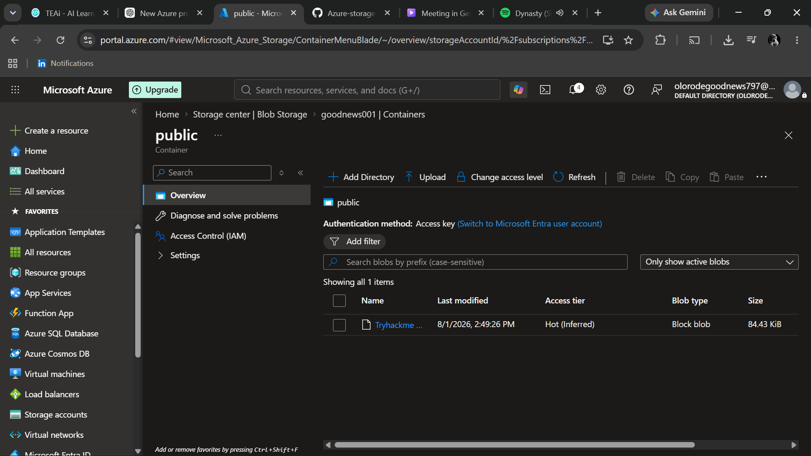
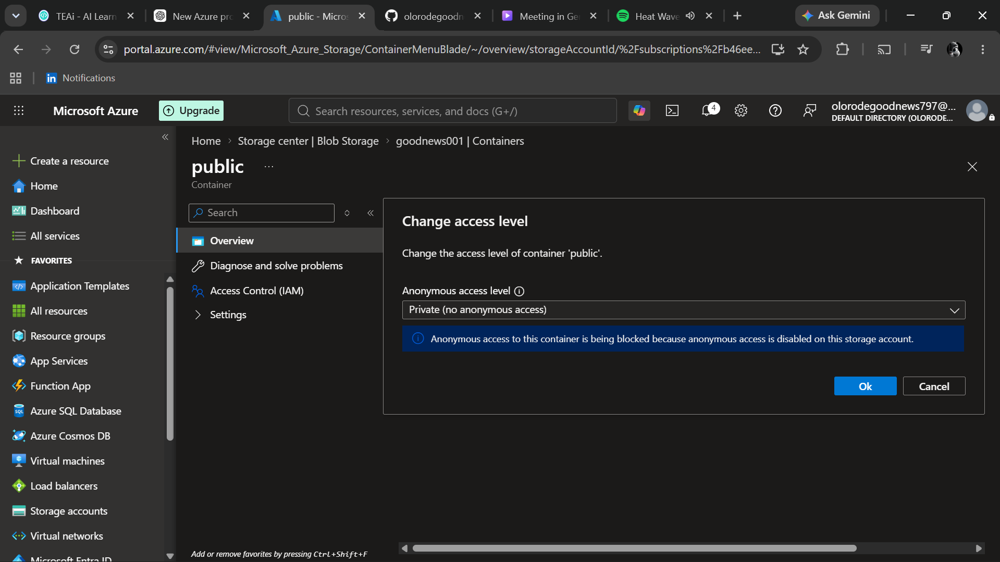
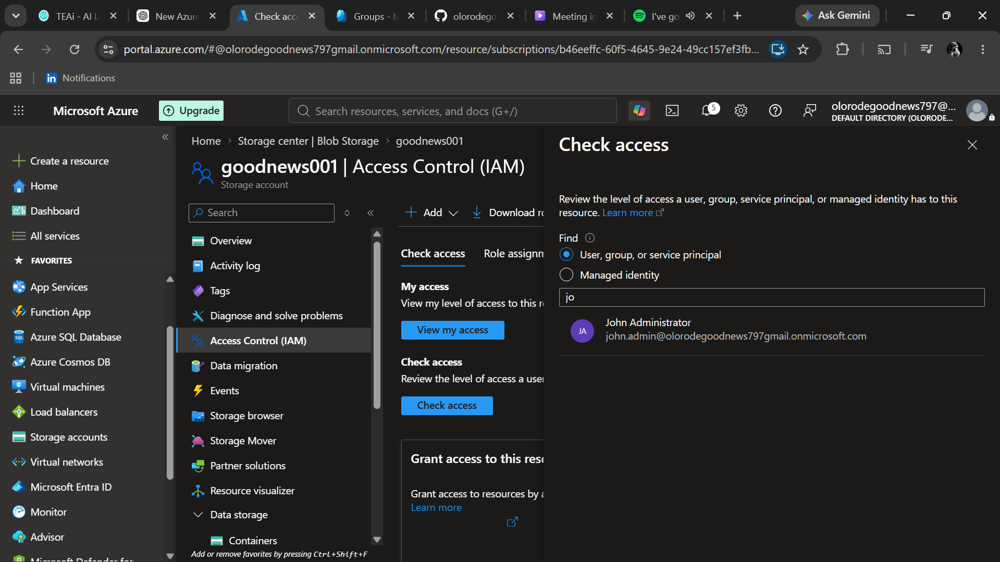

# Azure-storage-lab
Hands-on Azure Storage lab based on Microsoft Learn. This project documents the creation and management of Azure Storage resources.

## Step 1 – Create an Azure Storage Account

### Objective

Create an Azure Storage Account to provide secure and scalable cloud storage for Azure services.

### Configuration

| Setting | Value |
|---------|-------|
| Resource Group | IAM-RBAC-Lab-RG |
| Performance | Standard |
| Redundancy | Locally Redundant Storage (LRS) |

### Why?

An Azure Storage Account is the foundation for Azure storage services such as Blob Storage, Azure Files, Queue Storage, and Table Storage.

### Result

The Azure Storage Account was successfully created.

### Screenshot

---

## Step 2 – Create a Blob Container

### Objective

Create a Blob Container inside the Azure Storage Account to organize and store blob data.

### Configuration

| Setting | Value |
|---------|-------|
| Container Name | public |
| Access Level | Private (No anonymous access) |

### Why?

A Blob Container provides a logical way to organize files stored in Azure Blob Storage.

### Result

The Blob Container was successfully created and is ready to store blobs.

### Screenshot

## Step 3 – Upload a Blob

### Objective

Upload a file to the Blob Container to verify that the Storage Account is ready to store data.

### Configuration

| Setting | Value |
|---------|-------|
| Storage Service | Azure Blob Storage |
| Container | goodnews001 |
| Uploaded File | Tryhackme Soc Level 1 Certificate |

### Why?

Uploading a blob confirms that the Blob Container is working correctly and can securely store files.

### Result

The file was successfully uploaded to the Blob Container.

### Screenshot

---

## Step 4 – Configure the Blob Container Access Level

### Objective

Review and configure the access level of the Blob Container.

### Configuration

| Setting | Value |
|---------|-------|
| Container | goodnews001 |
| Access Level | *(Private / Blob / Container)* |

### Why?

The access level determines who can read or list the blobs stored in the container. Keeping containers private is a security best practice unless public access is required.

### Result

The Blob Container access level was reviewed and configured as required.

### Screenshot

---

## Step 5 – Assign Azure RBAC Permissions

### Objective

Grant a group permission to access blob data using Azure Role-Based Access Control (RBAC).

### Configuration

| Setting | Value |
|---------|-------|
| Resource | Azure Storage Account |
| Role | Storage Blob Data Reader |
| Assigned To | John Administrator |

### Why?

Azure RBAC allows administrators to grant only the permissions required for a user's role, following the principle of least privilege.

### Result

The selected group was successfully assigned the **Storage Blob Data Reader** role.

### Screenshot

---

## Step 6 – Generate a Shared Access Signature (SAS) Token

### Objective

Generate a Shared Access Signature (SAS) to provide secure, temporary access to blob data.

### Configuration

| Setting | Value |
|---------|-------|
| Service | Blob |
| Resource Type | Object |
| Permission | Read |
| Protocol | HTTPS Only |

### Why?

A SAS token provides time-limited access to Azure Storage resources without exposing the storage account keys.

> **Security Note:** The Connection String, SAS Token, and Blob Service SAS URL screenshot will not be shown because it is exposing sensitive credentials. This follows Azure security best practices.
